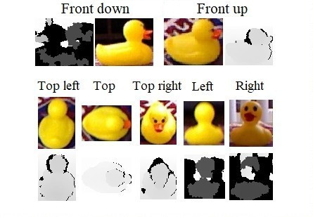
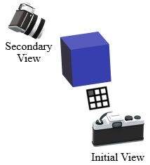

# Next Best View Dataset
A dataset for testing next best view merthods as a part of active vision systems. 

## Description
This dataset can be used to examine the effectiveness of active vision systems in determining the next best view (NBV) of objects. Active vision represents a set of techniques that attempt to incorporate new visual data by employing camera motion. Next best view determination is a branch of active vision methods to find a new viewpoint of an object or a scene that provides the most useful information for a vision task.

The dataset contains the images and three-dimensional (3D) depth maps of 10 different objects: apple, burger, cocoa container, cup, drill, duckling toy, orange, sandwich, sugar container, and tea pot. A Kinect v1 was used to capture the images and depth maps. There are 24 sets of images taken for each object, which provides a total of 240 image sets. Each set has images and 3D depth maps that are captured from different sides of an object in various lighting conditions and backgrouns. There are two frontal images in each set that can be used as the initial view of the object. Based on the information available in the frontal image, then the next best view method should decide which side of the object to look next: right, upper right, top, upper left, or left side of the object. The below figure shows one of the image sets in the dataset. There are two frontal captures that can be used as the initial viewpoint and five secondary captures that may be be used for testing any NBV method. Each capture consists of an RGB image and a 3D depth map.



After fetching the respective viewpoint of the object from the selected view direction, the effectiveness of the NBV-based active vision system can be verified. The below figure shows a sample situation, in which after taking a frontal image (initial view), the next viewpoint (secondary view) is chosen to be the upper left side of the object.



As a practical example, we used this dataset to gauge the effectiveness of a next best view system we developed for active object recognition. At the test time, each of the two frontal images were used separately by the NBV method to decide the next viewpoint, only if the active vision system was not coinfident enough about classification of the object. Subsequently, the classification of the objects in the frontal and the selected side view were fused to reach the final classification decision. In this way, the current dataset helped in measuring the improvement of the classification performance in our work. It can, however, be used to test different active vision or next best view systems.

**Note**: In order to make the dataset suitable for classification applications, a set of training files for all the 10 object classes in the test dataset is also provided. 

## The Files
The dataset files for testing next best view systems are placed under the *Test_Files* directory. As mentioned, there are 240 sets of images, each in folders named from 0 to 239. RGB files are stored in *jpg* format, while 3D depth maps are stored in *npy* format, which is readable by using the numpy library. The following table relates the name of each image and depth map file to the capture direction of the camera:

|File name|Capture direction|
|---|---|
|1|Upper left|
|2|Top|
|3|Upper right|
|4|Left|
|5|Right|
|Front_Down|The frontal view with the same height as the object|
|Front_Up|An alternate frontal view, with a slightly higher elevation than the other frontal view|

In addition, the label of the object being seen is provided in the *label.txt* file. These labels can be used in object classification tasks.

The contents of the *Training_Files* directory are RGB training images of the 10 object classes that are present in the test set. They can be used for training classifiers if the active vision system needs to classify the objects in the test images too.

<!-- 

# Citation
If you are using this dataset, please cite our papers below, in which this dataset is introduced:

```
@article{hoseini2013,
  title={A one-shot next best view system for active object recognition},
  author={Hoseini, Pourya and Nicolescu, Mircea and Nicolescu, Monica},
  journal={Applied Intelligence},
  volume={},
  number={},
  pages={--},
  year={},
  publisher={Springer}
}
```

```
@inproceedings{hoseini2021surface,
  title={A aurface and appearance-based next best view system for active object recognition},
  author={Hoseini, Pourya and Paul, Shuvo K. and Nicolescu, Mircea and Nicolescu, Monica},
  booktitle={16th International Conference on Computer Vision Theory and Applications (VISAPP)},
  year={2021},
  pages={--}
}
```

-->

# Developers
[Pourya Hoseini](https://github.com/pouryahoseini) and Mircea Nicolescu.

# Contact
You may contact us at the following email addresses:
* Pourya Hoseini: hoseini@nevada.unr.edu
* Mircea Nicolescu: mircea@cse.unr.edu